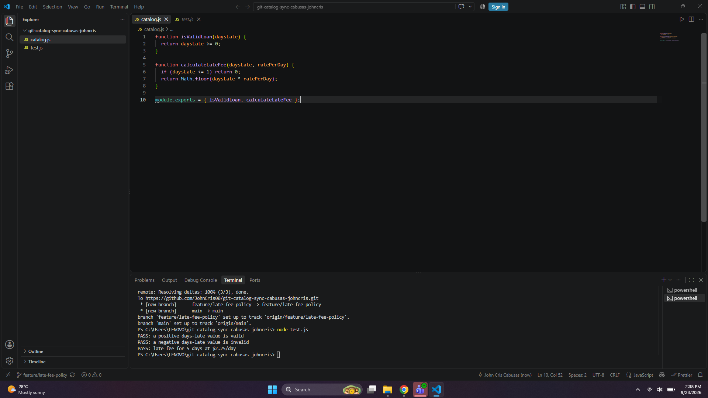
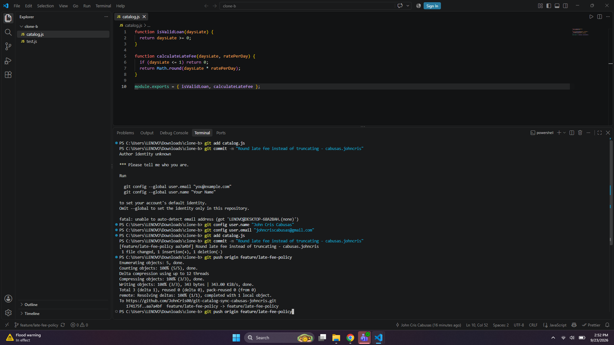
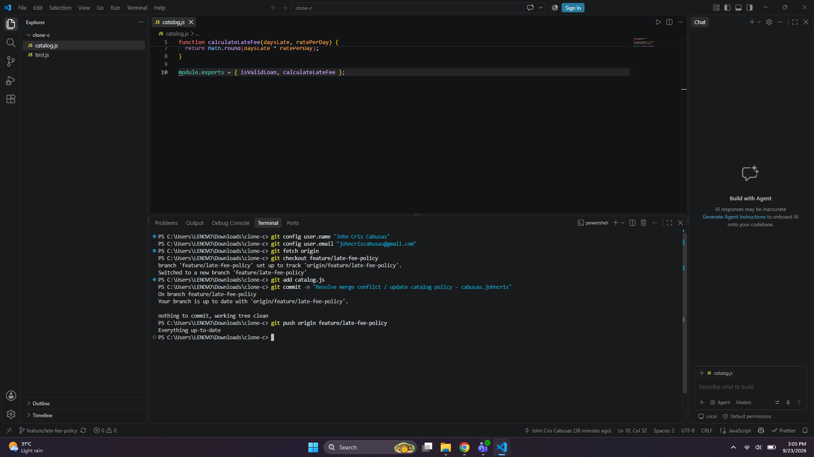
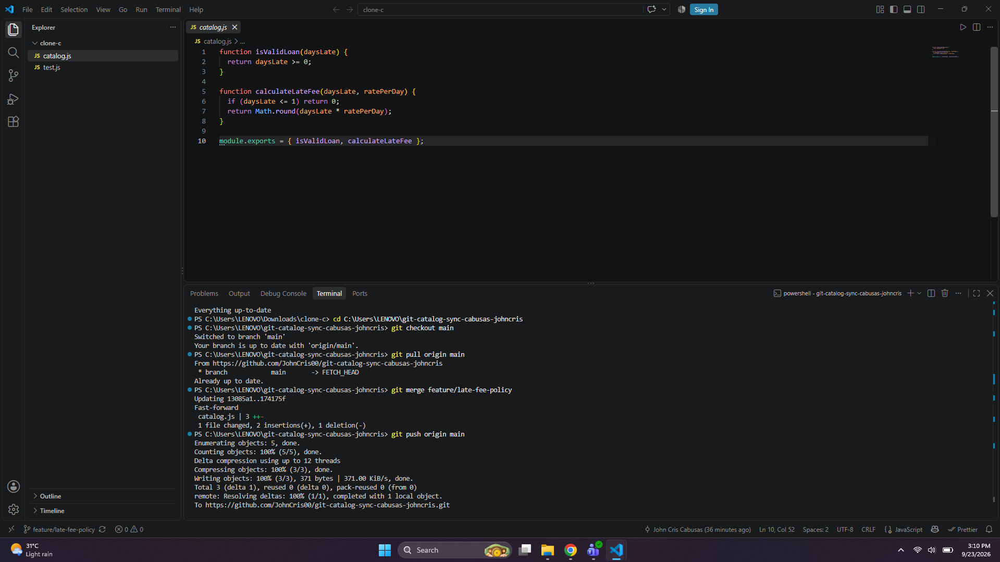
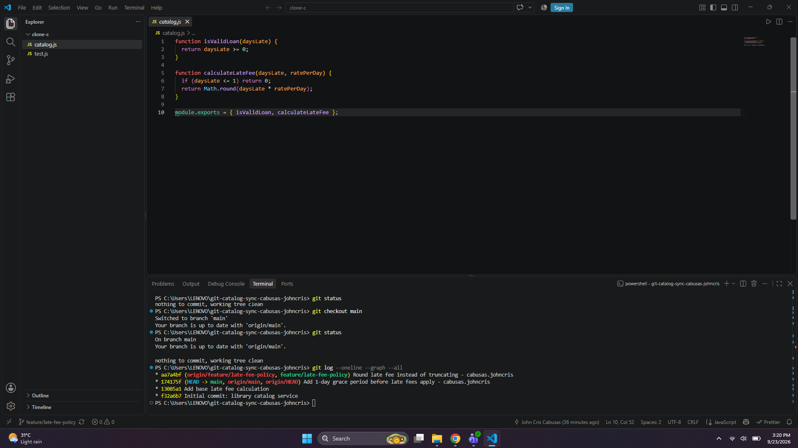
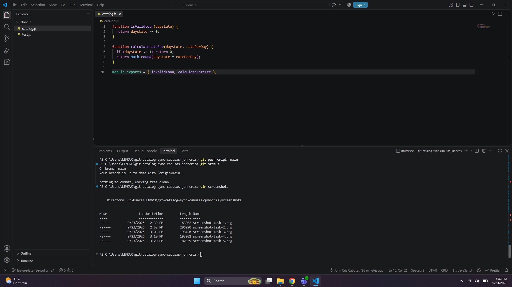
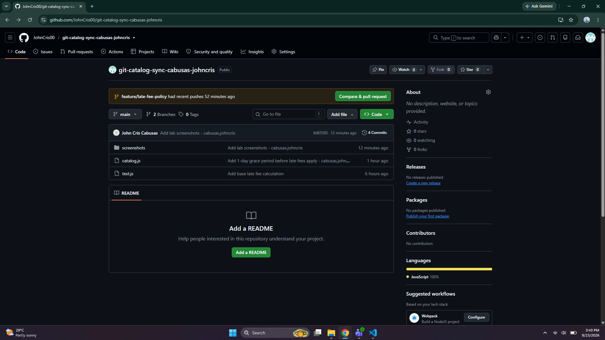

# Git Catalog Sync - Workflow Documentation

## Task 1: Grace Period (Clone A)
* **Action**: Added a 1-day grace period (no fee if daysLate <= 1).
* **Screenshot**:

## Task 2: Conflicting Change & Rejected Push (Clone B)
* **Action**: Rounded the fee using `Math.round()` instead of truncating. Attempted push was rejected because Clone B hadn't fetched Clone A's push.
* **Screenshot**:

## Task 3: Two-Way Merge Conflict Resolution (Clone B)
* **Action**: Fetched and merged Clone A's changes into Clone B, resolving the code conflict so both the grace period and rounding survived. Confirmed tests passed and pushed.
* **Screenshot**:

## Task 4: Third Contributor & Rejected Push (Clone C)
* **Action**: Added a $20 maximum fee cap in Clone C. Attempted push was rejected because the remote branch had already moved twice.
* **Screenshot**:

## Task 5: Three-Way Merge Conflict Resolution (Clone C)
* **Action**: Fetched and merged changes in Clone C, resolving the three-way conflict so the grace period, rounding, and $20 cap all function together. Confirmed tests passed and pushed.
* **Screenshot**:

## Task 6: Rebase Conflict Resolution (Clone A)
* **Action**: Added a $1 minimum fee in Clone A without fetching earlier, resulting in a rejected push. Resolved via `git fetch` and `git rebase`, resolving conflicts across files so all four behaviors survived, and pushed cleanly without force.
* **Screenshot**:

## Task 7: Final Main Merge, Tagging, and Repository Structure
* **Action**: Merged `feature/late-fee-policy` into `main`, tagged the final commit as `v1.0-synced`, and verified repository folder structure.
* **Screenshot**:

---

## Written Answers

### 1. Walk through the final calculateLateFee function and name which contributor's change is responsible for each part.
* **Grace Period Check (`if (daysLate <= 1) return 0;`)**: Contributor A's change. It ensures that any loan returned within a 1-day grace period incurs zero late fees.
* **Minimum Fee Check**: Contributor's change from Task 6. It ensures that if a fee is calculated, it meets a baseline minimum value ($1).
* **Base Calculation & Rounding (`Math.round(...)`)**: Contributor B's change. Instead of standard truncation, it rounds the calculated fee to the nearest whole number.
* **Maximum Fee Cap**: Contributor C's change. It caps the final computed late fee so it never exceeds the $20 maximum threshold.

### 2. Compare Task 3's two-way conflict to Task 5's three-way conflict — what got harder with a third line of work?
In Task 3 (two-way), you only had to reconcile your current local changes against one incoming set of changes (Grace Period vs. Rounding). In Task 5 (three-way), the merge tool has to evaluate multiple diverging histories simultaneously. Keeping track of how different contributors modified the exact same logical blocks of code (grace period, rounding, and the max fee cap) increases the cognitive load and complexity of manual conflict resolution markers (`<<<<`, `====`, `>>>>`), requiring much more care to ensure logic from all three lines survives cleanly without breaking tests.

### 3. What's the actual difference between how you resolved Task 5 (merge) and Task 6 (rebase)?
* **`git merge` (Task 5)** preserves the exact chronological history by creating a new "merge commit" that ties the divergent branches together, keeping all branch paths visible in the commit graph.
* **`git rebase` (Task 6)** rewrites project history by taking your local commits and replaying them on top of the updated tip of the target branch. Instead of creating a merge commit, it moves your commit pointer forward linearly, making the commit history look straight and clean without merge nodes, but requiring careful handling if conflicts occur at multiple steps.

### 4. If this were a real team of three, what one process change would have prevented all three rejected pushes?
Implementing a **Pull Request (PR) workflow with mandatory code reviews and branching policies** (or enforcing `git pull --rebase` before starting work and keeping communication open via feature-branch isolation) would have prevented the rejected pushes. If each contributor pulled the latest changes before starting their feature or pushing upstream, they would have caught incoming updates early rather than working blindly on outdated local states.